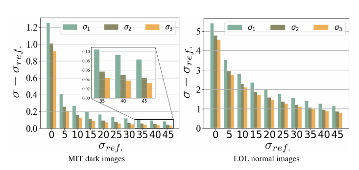
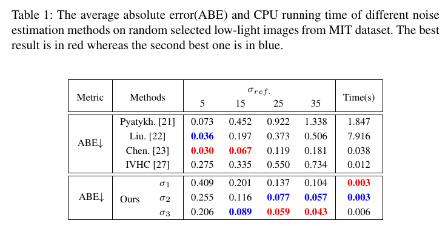

# Fast gaussian noise estimation for low-light images

## Noise Estimation

The gradient characteristics of image can reflect the distribution of potential noise. Thus, we use the higher order gradient of the image to estimate the noise intensity. After a rigorous theoretical derivation the following equation is given:

$$ \sigma \approx \psi(\nabla^{n}\mathbf{x}):= \frac{\sqrt{\pi}E|\nabla^{n}\mathbf{x}|}{\sqrt{2\Sigma_{k=0}^{n} [C_{n}^{k}]^2}}. $$


In this equation, $\nabla^{n} \mathbf{x}$ signifies the $n$-order image gradient. For a given image with pixel coordinate position $p$, the gradient can be calculated as $\nabla\mathbf{x}(p)= \mathbf{x}(p)-\mathbf{x}(p+1)$. When $n$ is greater than 1, the computation can be recursively performed using $\nabla^{n} \mathbf{x}(p)=\nabla^{n-1} \mathbf{x}(p)-\nabla^{n-1} \mathbf{x}(p+1)$.
The symbol $C$ represents the mathematical notation for combinations, defined as $C_{n}^{k} = \frac{n!}{k!(n - k)!}$. Here, $E$ signifies the expectation.


## Result

 

Our method is suitable for dark images. $\sigma$ is higher, the result is more accurate.

 

## Citation
If you use this code, please consider citing:

```
@misc{liu2024nai2,
      title={NAI$_2$: Learning Noise-Aware Illumination-Interpolator for Unsupervised Low-Light Image Enhancement}, 
      author={Xiaofeng Liu and Jiaxin Gao and Xin Fan and Risheng Liu},
      year={2024},
      eprint={2305.10223},
      archivePrefix={arXiv},
      primaryClass={cs.CV}
}
```